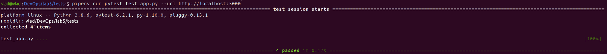
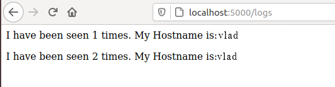
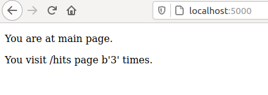

# Lab5
### 1. Ознайомився з docker-compose.
### 2. Створив папку my_app, tests. Скопіювала файли з репозиторію devops_course.
### 3. Виконав наступні команди:
####pip3 install redis
####pipenv --python 3.8
####pipenv install -r requirements.txt
####pipenv run python app.py
### 4. Відкривши нову вкладку терміналу я запустив наступну команду:
####pipenv run pytest test_app.py --url http://localhost:5000
### 5. Створив папку logs (в папці з додатком), в якій створив файл app.log
#### 
#### REPO - змінна для збереження назви Docker репозиторію
### 6. Запустив додаток та переконався, що він робочий
#### 
#### 
### 7. Створив директиву push - слугує для завантаження імеджів у Docker Hub репозиторій
### 8. Cтворив директиву remove для видалення локальних імеджів.
### 9. Я створив компоуз файл,в якому було створено дві мережі(public та secret). Запустив docker-compose.
### 10.Сайт працює. Адреса: localhost:80
### 11. Композ створив Docker імеджі
####bobas/lab4-examples compose-tests
####bobas/lab4-examples compose-app
####python 3.7-alpine
####python 3.7-alpine
### 12. Змінивв тег імейджів, перезапустив docker-compose та почистив імейджі за допомогою remove
### 13. Зупинив проект (Сtrl+C), очистив ресурси створені компоузом.
### 14. За допомогою команди docker-compose push завантажив створені імеджі в репозиторій.
### 15. Створив docker-compose.yml для лабораторної №4
